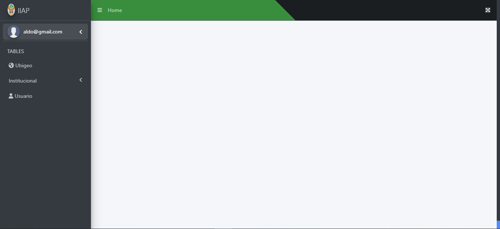
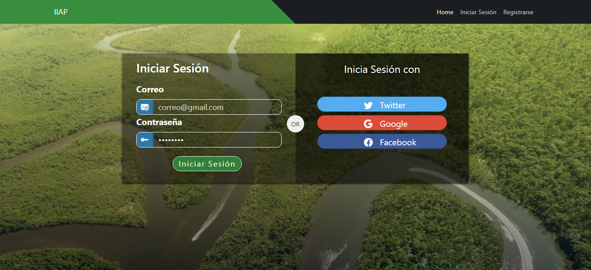
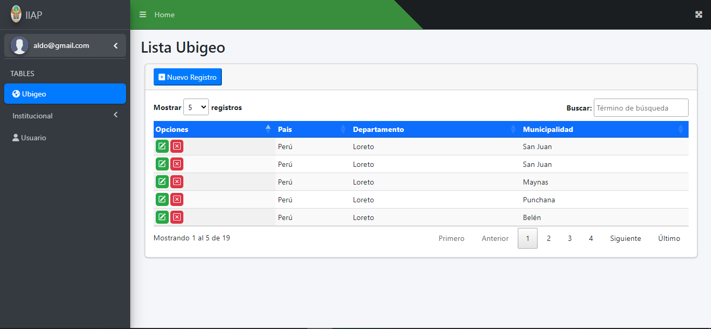
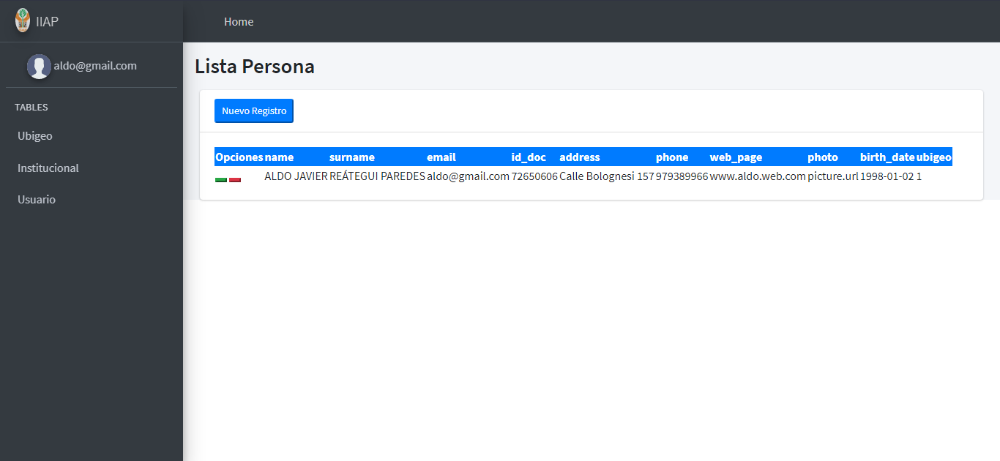
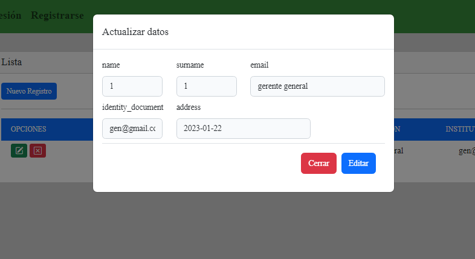
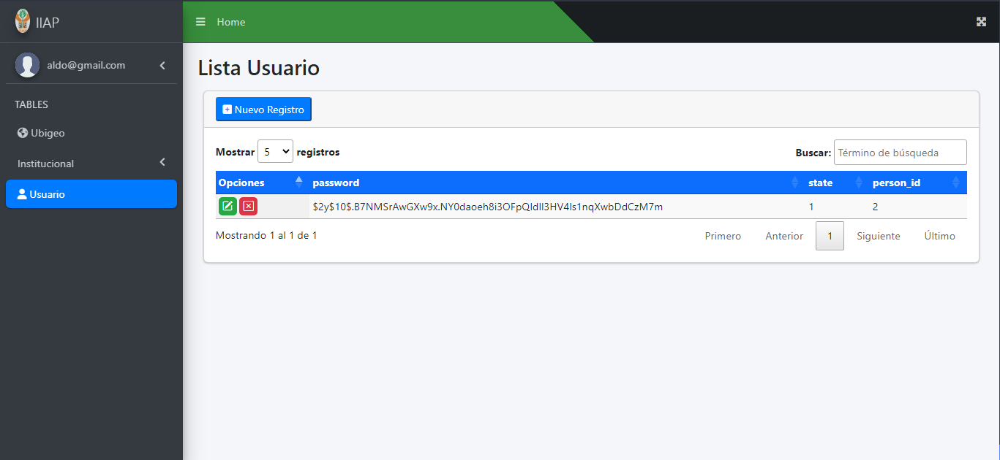
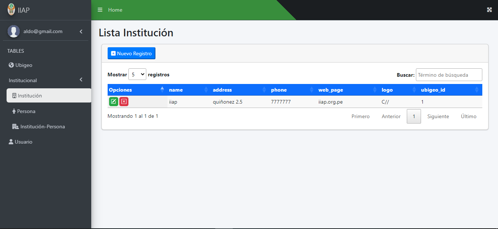
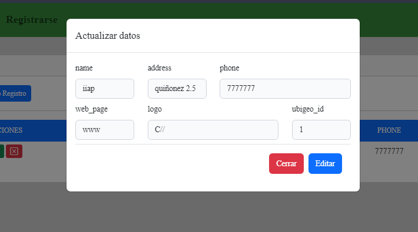

# Iniciar proyecto

Para poner en marcha el proyecto se deben ejecutar los siguientes comandos:

* npm install

* composer install

* php artisan migrate

* php artisan db:seed UbigeoSeeder

* php artisan db:seed InstitutionSeeder

* php artisan db:seed PersonSeeder

* php artisan db:seed UserSeeder

* php artisan serve

# MS-Directory
Sistema de Marketing módulo Directorio, podrá realizar las funciones de vizualizar, agregar, editar y eliminar registros en las cinco tablas presentes en la base de datos. Entre las opciones disponibles estan:
1. [Ubigeo](#Ubigeo)
2. [Personas](#Personas)
3. [Instituto-Persona](#Instituto-Persona)
4. [Usuarios](#Usuarios)
5. [Institución](#Institución)
## Vistas del sistema Usuario Administrador
* Se dispone del menú opciones en el lateral izquierdo, la barra de navegación en la parte superior de la pantalla

 
Pantalla principal de la vista del administrador

## 
* Se muestra el formulario con las credenciales **email** y **contraseña**

 
Vista de inicio de sesión

## 
* Se muestra el formulario para el registro de una nueva persona y usuario.

 
Vista de registro

# Ubigeo
* Se muestra los registros de la tabla *ubigeo y se dividen en paginas de 5 registros.

 

### Agregar Ubigeo
* Se muestra el formulario para registrar los datos de un nuevo ubigeo.

 

### Editar ubigeo
* Se muestra el formulario para modificar los datos de un ubigeo existente.

 
Vista de editar ubigeo

### Eliminar ubigeo
* Se despliega una ventaja de confirmación para confirmar el borrado del registro.

 

# persona
* Se muestran los registros de la tabla personas.

 

## agregar persona
* Se despliega un formulario con los datos necesarios para agregar un registro.

 

## editar persona
* Se despliega un formulario para editar un registro de persona.

 

# instituto - persona
* Se muestran los registros existentes.

 

## agregar instituto - persona
* Se despliega un formulario para agregar un registro.

 

## editar instituto - persona
* Se despliega un formulario para editar un registro.

 

# usuario
* Se muestran los registros de usuarios existentes.

 

## agregar instituto - persona
* Se despliega un formulario para agregar un registro.

 

## editar instituto - persona
* Se despliega un formulario para editar un registro.

 

# institución
* Se muestran los registros de institutos existentes.

 

## agregar institución
* Se despliega un formulario para agregar un registro.

 

## editar institución
* Se despliega un formulario para editar un registro.

 

# Validaciones
* cada formulario cuenta con las validaciones correspondientes para que no se puedan ingresar datos inesperados en los registros.

 
